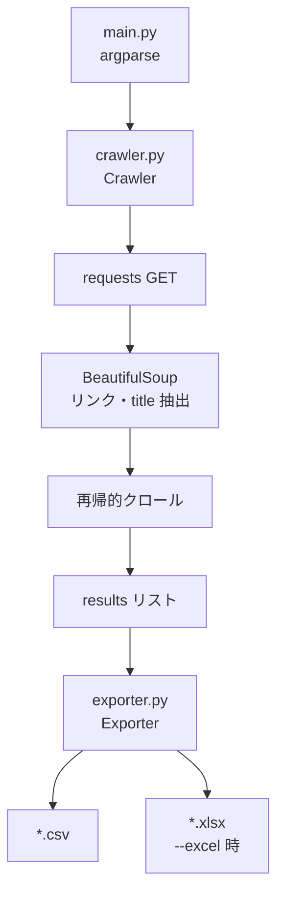

# プロジェクト概要・実装状況・利用ガイド

本ドキュメントは、**extreme-super-site-mapper-final-edition**（サイトマップ自動生成ツール）の現状実装を調査した結果をまとめたものです。セットアップ手順、CLI の使い方、出力形式、既知の制限、今後の開発方針を記載しています。

関連ドキュメント:

| ファイル | 内容 |
|---|---|
| [サイトマップ自動生成ツール 仕様書.md](./サイトマップ自動生成ツール%20仕様書.md) | 当初の要件定義・非機能要件 |
| [site_structure.md](./site_structure.md) | 実サイトのクロール結果から生成したサイト構造ツリー（参考資料） |
| [README.md](../README.md) | リポジトリトップのクイックスタート |

---

## 1. プロジェクト概要

### 1.1 目的

既存ウェブサイトを再帰的に巡回（クローリング）し、リプレイス計画などの基礎資料となる **ページリスト（URL・タイトル・HTTPステータス・深度）** を抽出する CLI ツールです。

### 1.2 技術スタック

| 項目 | 採用技術 |
|---|---|
| 言語 | Python 3.9+ |
| パッケージ管理 | [uv](https://astral.sh/uv/) |
| HTTP 通信 | `requests` |
| HTML 解析 | `beautifulsoup4` |
| データ出力 | `pandas` + `openpyxl`（Excel 用） |

### 1.3 ディレクトリ構成

```
extreme-super-site-mapper-final-edition/
├── main.py              # CLI エントリポイント
├── crawler.py           # クローリングロジック（Crawler クラス）
├── exporter.py          # CSV / Excel 出力（Exporter クラス）
├── pyproject.toml       # 依存関係定義
├── uv.lock              # ロックファイル
├── .python-version      # Python 3.9
├── test-server/         # ローカル動作確認用の簡易 HTML サイト
│   ├── index.html
│   ├── page1.html
│   ├── page2.html
│   └── sub/page3.html
└── docs/                # ドキュメント
```

### 1.4 アーキテクチャ



**処理の流れ:**

1. `main.py` が CLI 引数を解析し `Crawler` を初期化
2. `Crawler.crawl()` が開始 URL から深さ優先（DFS）で再帰的にリンクを辿る
3. 各ページで HTTP ステータス・`<title>`・深度を `results` に蓄積
4. HTML ページのみ `<a href>` から次の URL を抽出
5. 完了後（または Ctrl+C 中断時）`Exporter` が CSV / Excel に書き出し

---

## 2. 実装状況

### 2.1 実装済み機能

| 機能 | 実装 | 詳細 |
|---|---|---|
| 再帰的クローリング | ✅ | `<a href>` からリンクを抽出し DFS で巡回 |
| ドメイン制御（ホワイトリスト） | ✅ | 開始 URL のドメイン + `--subdomains` で指定したドメインのみ |
| 外部リンク除外 | ✅ | 許可ドメイン外・`http/https` 以外はスキップ |
| URL / タイトル / ステータス取得 | ✅ | `results` に `url`, `title`, `status`, `depth` を記録 |
| CSV 出力 | ✅ | UTF-8 BOM（`utf-8-sig`）で Excel 互換 |
| Excel 出力 | ✅ | `--excel` 指定時に `.xlsx` も生成 |
| リクエスト間隔（Delay） | ✅ | デフォルト 1.0〜3.0 秒のランダム待機 |
| シングルスレッド | ✅ | 並列リクエストなし |
| User-Agent 明示 | ✅ | `SitemapGenerator/1.0 (+https://github.com/...)` |
| 重複クロール防止 | ✅ | `visited_urls`（完全一致）と `visited_paths`（パス単位） |
| クエリパラメータ集約 | ✅ | デフォルトで同一パスは 1 回のみクロール（`--include-params` で無効化） |
| 最大深度制限 | ✅ | `--max-depth N` |
| Content-Type 判定 | ✅ | `text/html` 以外はリンク抽出をスキップ（結果には記録） |
| 文字コード自動判別 | ✅ | `response.apparent_encoding` を使用 |
| URL フラグメント除去 | ✅ | `#` 以降を除去して正規化 |
| Ctrl+C 中断時の部分保存 | ✅ | `{出力名}_partial.csv` に保存して終了 |
| 出力ファイル名の自動決定 | ✅ | 未指定時は開始 URL のドメイン名を使用 |
| 深度（depth）の記録 | ✅ | 仕様書にはないが実装で追加 |

### 2.2 未実装・部分実装

| 機能 | 状態 | 仕様書での言及 |
|---|---|---|
| 特定ディレクトリの除外 | ❌ 未実装 | 推奨追加要件 |
| Basic 認証対応 | ❌ 未実装 | 推奨追加要件 |
| Last-Modified ヘッダー取得 | ❌ 未実装 | 推奨追加要件 |
| robots.txt 遵守 | ❌ 未実装 | — |
| sitemap.xml からのシード URL | ❌ 未実装 | — |
| JavaScript レンダリング（SPA）対応 | ❌ 未実装 | — |
| リトライ・タイムアウト設定の CLI 化 | ❌ 未実装 | タイムアウトは 10 秒固定 |
| サイト構造ツリー自動生成 | ❌ 未実装 | `site_structure.md` は手動/別処理の成果物 |
| 自動テスト | ❌ 未実装 | — |
| Docker 化 | ❌ 未実装 | 仕様書で候補として言及 |
| ログファイル出力 | ❌ 未実装 | 標準出力への INFO ログのみ |
| 中断後の再開（レジューム） | ❌ 未実装 | partial CSV は保存するが再開機能なし |

### 2.3 実運用での検証状況

リポジトリ内の出力ファイルから、以下の検証が行われていることが確認できます。

| 出力ファイル | 想定対象 | ページ数 |
|---|---|---|
| `localhost_8000.csv` | `test-server/`（ローカル HTTP サーバー） | 5 ページ |
| `voi.0101.co.jp_partial.csv` | 本番 EC サイト（中断あり） | 4,233 ページ |
| `sitemap_partial.csv` | 別サイトの中断結果 | — |

`localhost_8000.csv` の結果例:

```csv
url,title,status,depth
http://localhost:8000,Test Home,200,0
http://localhost:8000/page1.html,Test Page 1,200,1
http://localhost:8000/index.html,Test Home,200,2
http://localhost:8000/page2.html,Test Page 2,200,3
http://localhost:8000/sub/page3.html,Test Page 3,200,2
```

> **注意:** DFS のため、リンクの出現順によって深度が直感的でない場合があります（上記例では `page2.html` が depth 3 になっている）。BFS への変更は今後の改善候補です。

---

## 3. 使用方法

### 3.1 環境セットアップ

**前提:** Python 3.9 以上、[uv](https://astral.sh/uv/) がインストール済みであること。

```bash
# リポジトリのルートで実行
cd extreme-super-site-mapper-final-edition

# 依存関係のインストール
uv sync
```

### 3.2 基本コマンド

```bash
uv run main.py <開始URL>
```

開始 URL のドメイン名がそのまま出力ファイル名になります（例: `https://example.com/` → `example.com.csv`）。

### 3.3 CLI オプション一覧

| オプション | 型 | デフォルト | 説明 |
|---|---|---|---|
| `url` | 必須引数 | — | クロール開始 URL |
| `--subdomains` | 複数指定可 | なし | 追加で許可するドメイン（スペース区切り） |
| `--output` | 文字列 | `sitemap`（→ ドメイン名に自動変換） | 出力ファイルのベース名（拡張子なし） |
| `--delay-min` | 浮動小数 | `1.0` | リクエスト間の最小待機秒数 |
| `--delay-max` | 浮動小数 | `3.0` | リクエスト間の最大待機秒数 |
| `--max-depth` | 整数 | なし（無制限） | 最大巡回深度 |
| `--excel` | フラグ | オフ | Excel（`.xlsx`）も同時出力 |
| `--include-params` | フラグ | オフ | クエリパラメータ違いの URL もすべて巡回 |

### 3.4 使用例

#### ローカルテストサーバーでの動作確認

```bash
# 別ターミナルでテストサーバーを起動
cd test-server
python3 -m http.server 8000

# クロール実行
uv run main.py http://localhost:8000 --output localhost_8000
```

#### 本番サイトの調査（負荷に配慮）

```bash
# 待機時間を長めに、深度を制限
uv run main.py https://example.com \
  --delay-min 2.0 \
  --delay-max 5.0 \
  --max-depth 5 \
  --excel
```

#### サブドメインを含める場合

```bash
uv run main.py https://www.example.com \
  --subdomains cdn.example.com blog.example.com
```

> `--subdomains` は **完全一致** でドメインを追加します。`*.example.com` のようなワイルドカードは未対応です。

#### ページング URL をすべて取得したい場合

```bash
# ?page=1, ?page=2 などを個別にクロール
uv run main.py https://example.com/blog --include-params
```

#### 中断と部分結果の保存

`Ctrl+C` で中断すると、それまでの結果が `{出力名}_partial.csv` に保存されます。

```bash
uv run main.py https://voi.0101.co.jp/voi/
# ... 途中で Ctrl+C
# → voi.0101.co.jp_partial.csv が生成される
```

### 3.5 出力形式

#### CSV / Excel のカラム

| カラム | 型 | 説明 |
|---|---|---|
| `url` | 文字列 | クロールした URL（クエリパラメータ含む） |
| `title` | 文字列 | `<title>` タグのテキスト。取得不可時は `No Title` |
| `status` | 数値 or 文字列 | HTTP ステータスコード。エラー時は `Error` |
| `depth` | 整数 | 開始 URL からのリンク辿り深度（0 = 開始ページ） |

#### 特殊な `title` 値

| 値 | 意味 |
|---|---|
| `No Title` | `<title>` タグが存在しない |
| `Non-HTML Content` | Content-Type が `text/html` 以外 |
| `Error: {例外名}` | リクエストまたはパース中に例外が発生 |

#### 出力ファイル名の規則

| 状況 | ファイル名 |
|---|---|
| 正常完了 | `{output}.csv`（`--excel` 時は `{output}.xlsx` も） |
| Ctrl+C 中断 | `{output}_partial.csv` のみ（Excel は生成されない） |
| `--output` 未指定 | 開始 URL のホスト名（`:` は `_` に置換） |

---

## 4. 各モジュールの詳細

### 4.1 `main.py`

- `argparse` による CLI 定義
- `Crawler` の初期化と `crawl()` 呼び出し
- 正常終了時: CSV（+ 任意で Excel）出力
- `KeyboardInterrupt`: 部分 CSV 保存
- その他の例外: エラーメッセージ表示後 `exit(1)`

### 4.2 `crawler.py` — `Crawler` クラス

**主要な内部状態:**

| 属性 | 用途 |
|---|---|
| `visited_urls` | アクセス済み URL の完全一致セット |
| `visited_paths` | スキーム+ホスト+パス単位の訪問セット（パラメータ集約用） |
| `results` | クロール結果のリスト |
| `allowed_domains` | 許可ドメインのセット |

**`is_valid_url(url)` の判定順序:**

1. ドメインが `allowed_domains` に含まれるか
2. スキームが `http` または `https` か
3. `unique_path=True`（デフォルト）の場合、同一パスが `visited_paths` にないか
4. `unique_path=False` の場合、URL が `visited_urls` にないか

**クロール時の挙動:**

- 各リクエスト前に `delay_range` のランダム待機
- タイムアウト: 10 秒（ハードコード）
- HTML 以外の Content-Type は結果に記録するがリンク抽出は行わない
- 例外発生時も `results` にエラー行を追加し、処理は継続

### 4.3 `exporter.py` — `Exporter` クラス

- 静的メソッド `export_csv()` / `export_excel()`
- `pandas.DataFrame` 経由で書き出し
- エラー時はログ出力のみ（例外は再送出しない）

---

## 5. 既知の制限と注意事項

### 5.1 クローラーとしての制限

| 制限 | 影響 |
|---|---|
| JavaScript 非対応 | React / Vue 等の SPA ではリンクが検出できない |
| `<a>` タグのみ対象 | `<link>`, `<meta refresh>`, JS による遷移は未対応 |
| robots.txt 非遵守 | クロール禁止ページにもアクセスする可能性 |
| Basic 認証非対応 | ステージング環境など認証が必要なサイトは不可 |
| シングルスレッド DFS | 大規模サイトでは完了まで時間がかかる |
| 再帰呼び出し | 極端に深いサイトではスタックオーバーフローのリスク（通常は `--max-depth` で回避） |

### 5.2 同一パス集約の挙動

デフォルトでは `https://example.com/page?id=1` と `https://example.com/page?id=2` は **最初に遭遇した URL のみ** クロールされます。ログインリダイレクトなど、パラメータによって内容が大きく変わるページは `--include-params` の検討が必要です。

### 5.3 負荷・マナー

- デフォルトの 1〜3 秒待機は一般的なマナーですが、対象サイトの規約・負荷状況に応じて `--delay-min` / `--delay-max` を調整してください
- 本番 EC サイトなど大規模サイトでは、事前に関係者への確認を推奨します
- 中断用の `_partial.csv` は手動での再開には使えません（レジューム機能は未実装）

### 5.4 エラーハンドリング

- 個別 URL のエラーは `results` に記録され、全体のクロールは継続します
- `Exporter` の書き出し失敗はログのみで、プロセスは正常終了する可能性があります

---

## 6. 今後の追加開発の方向性

優先度の目安付きで整理しています。実務での利用頻度と実装コストを考慮した提案です。

### 6.1 優先度: 高（実務で直ちに効く）

| 項目 | 概要 | 実装の方向性 |
|---|---|---|
| **パス除外フィルタ** | `/wp-includes/`, `/assets/` 等をスキップ | `--exclude-paths` や `--exclude-pattern`（正規表現）を `is_valid_url()` に追加 |
| **Basic 認証** | ステージング環境の調査 | `--auth-user` / `--auth-pass` または `requests.auth.HTTPBasicAuth` |
| **robots.txt 遵守** | クロールマナー向上 | `urllib.robotparser` で Disallow パスを除外（`--ignore-robots` で無効化可能に） |
| **BFS + キュー方式** | 深度の一貫性・スタックオーバーフロー回避 | 再帰をやめ `collections.deque` で幅優先探索に変更 |
| **レジューム機能** | 中断後の続きから再開 | `_partial.csv` または checkpoint JSON から `visited_urls` を復元 |

### 6.2 優先度: 中（品質・分析力の向上）

| 項目 | 概要 | 実装の方向性 |
|---|---|---|
| **Last-Modified / Content-Length** | 移行優先度の判断材料 | `response.headers` から取得し出力カラムに追加 |
| **リトライ・タイムアウト設定** | 一時的なネットワークエラーへの耐性 | `--timeout`, `--retries` を CLI 化し `requests` の Session + Retry を使用 |
| **サイト構造ツリー生成** | `site_structure.md` の自動化 | CSV から URL パスをパースしてツリー Markdown / JSON を出力する `tree_exporter.py` |
| **重複タイトル・404 レポート** | 品質チェック | クロール後の集計サマリーをコンソールまたは別 CSV で出力 |
| **canonical URL の考慮** | 重複コンテンツの整理 | `<link rel="canonical">` を読み取り、正規 URL として記録 |
| **sitemap.xml シード** | 効率的な起点 URL の取得 | 開始時に `/sitemap.xml` をパースしキューに追加 |

### 6.3 優先度: 低〜中長期

| 項目 | 概要 | 実装の方向性 |
|---|---|---|
| **JavaScript レンダリング** | SPA 対応 | Playwright / Puppeteer 連携（オプション依存として分離） |
| **並列クロール** | 大規模サイトの高速化 | `asyncio` + `aiohttp` またはスレッドプール（`--concurrency` で制御） |
| **Docker 化** | 環境の統一 | `Dockerfile` + ボリュームマウントで CSV 出力 |
| **自動テスト** | 回帰防止 | `test-server/` を fixture にした pytest + HTTP モック |
| **設定ファイル** | 繰り返し実行の簡略化 | `crawl.yaml` で URL・除外パス・認証情報を定義 |
| **GUI / Web UI** | 非エンジニア向け | ファイルアップロード・進捗表示付きの簡易フロントエンド |

### 6.4 推奨する開発ロードマップ（案）

```
Phase 1 — 実用性の底上げ
  ├── パス除外フィルタ
  ├── Basic 認証
  ├── BFS へのリファクタ
  └── 単体テスト（test-server ベース）

Phase 2 — 分析・運用
  ├── Last-Modified 等のメタデータ追加
  ├── サイト構造ツリー自動生成
  ├── レジューム機能
  └── robots.txt 対応

Phase 3 — スケール・高度な対応
  ├── 設定ファイル（YAML）
  ├── 並列クロール（オプション）
  └── Playwright 連携（SPA オプション）
```

---

## 7. 開発者向けメモ

### 7.1 ローカル開発の流れ

```bash
# 依存関係の更新後
uv sync

# テストサーバー起動（別ターミナル）
python3 -m http.server 8000 --directory test-server

# 短い待機で素早く確認
uv run main.py http://localhost:8000 --delay-min 0.1 --delay-max 0.2 --output test_run
```

### 7.2 コード変更時の注意点

- `Crawler.crawl()` は再帰実装のため、BFS 化する場合は `is_valid_url()` と `visited_*` の更新タイミングを慎重に設計する
- `unique_path` と `visited_paths` の更新は `crawl()` 内のリクエスト前に行われている（未到達 URL も「訪問済みパス」になる点に注意）
- `Exporter` は例外を握りつぶすため、CLI 側での書き出し成功確認の強化が改善候補

### 7.3 依存パッケージ

`pyproject.toml` で定義:

```
beautifulsoup4 >= 4.14.3
openpyxl       >= 3.1.5
pandas         >= 2.3.3
requests       >= 2.32.5
```

---

## 8. 変更履歴

| 日付 | 内容 |
|---|---|
| 2026-06-30 | 初版作成（プロジェクト全体調査に基づく） |
